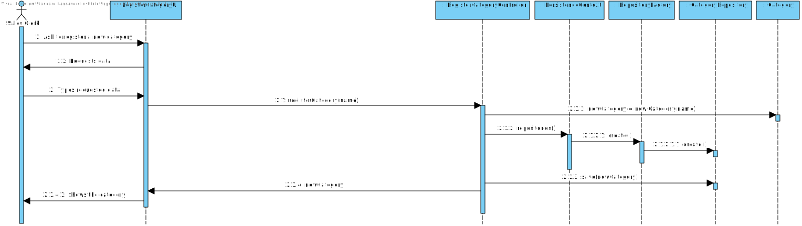

# US1005
=======================================

# 1. Requisitos

**US1003:** Como Sales Clerk pretendo ...

- Registar uma nova Catgeory

Deve ser possível registar uma nova Category indicando o seu nome desde de que o utilizador a fazê-lo seja um Sales Clerk. O seu ID será gerado automaticamente uma vez que é a PK (Primary Key) da tabela Category.

# 2. Análise

###Requisitos Funcionais
- O único dado necessário para a criação de uma nova category será a sua designação.
- Esta função pode ser desempenhada por um utilizador "administrador" (admin/poweruser) ou pelo Sales Clerk.

# 3. Design

## 3.1. Realização da Funcionalidade

## 3.3. Padrões Aplicados

*Nesta secção deve apresentar e explicar quais e como foram os padrões de design aplicados e as melhores práticas.*

## 3.4. Testes 
*Nesta secção deve sistematizar como os testes foram concebidos para permitir uma correta aferição da satisfação dos requisitos.*

**Teste 1:** Verificar que não é possível criar uma instância da classe Exemplo com valores nulos.

	@Test(expected = IllegalArgumentException.class)
		public void ensureNullIsNotAllowed() {
		Exemplo instance = new Exemplo(null, null);
	}

# 4. Implementação

*Nesta secção a equipa deve providenciar, se necessário, algumas evidências de que a implementação está em conformidade com o design efetuado. Para além disso, deve mencionar/descrever a existência de outros ficheiros (e.g. de configuração) relevantes e destacar commits relevantes;*

*Recomenda-se que organize este conteúdo por subsecções.*

# 5. Integração/Demonstração

*Nesta secção a equipa deve descrever os esforços realizados no sentido de integrar a funcionalidade desenvolvida com as restantes funcionalidades do sistema.*

# 6. Observações

*Nesta secção sugere-se que a equipa apresente uma perspetiva critica sobre o trabalho desenvolvido apontando, por exemplo, outras alternativas e ou trabalhos futuros relacionados.*

