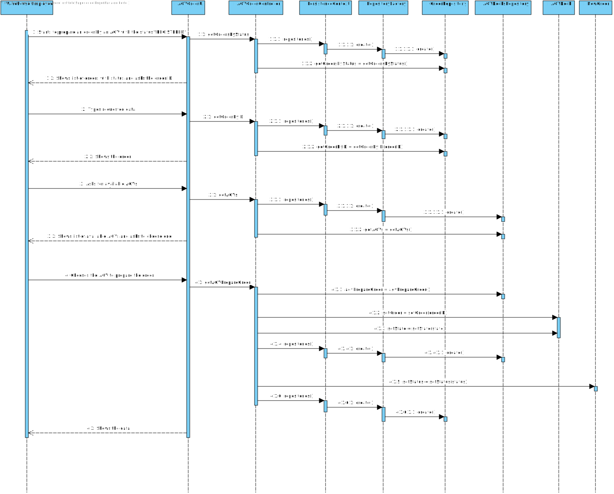
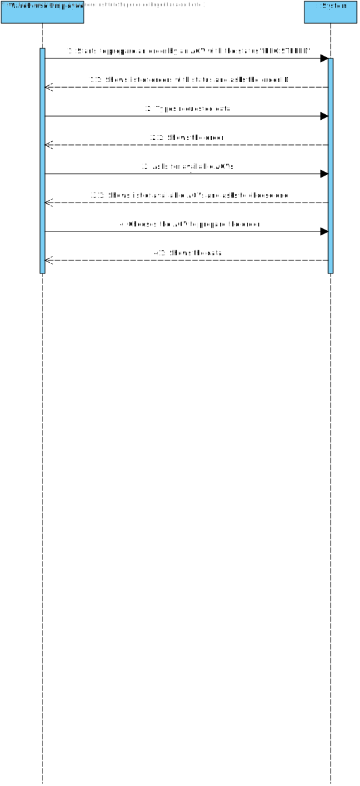

# US2003
=======================================

# 1. Requisitos

**US2003:** Como funcionário do Warehouse pretendo ...

- Ter acesso à lista de orders que precisam de ser preparadas pelo AGV e que possa obrigar/forçar qualquer uma dessas a ser preparada pelo AGV.

###From the client clarifications
* Q1: Does the warehouse employee chooses the intended AGV available to prepare the specific order or it should be assigned to any AGV available without even asking the warehouse employee?
	* A: The AGV is selected by the warehouse employee from the ones that are available and are able to perform the task.

* Q2: What would you consider to be its complete state, that is, what would be the criterion to define whether or not this feature was functional?
	* A: The warehouse employee is able to:
		* (i) select an order that needs to be prepared;
		* (ii) select the AGV from the ones that are available and able to perform the task;
		* (iii) the task is sent to the selected AGV
		* (iv) the order change its status.

* Q3: Is part of the System to allow users with greater skills and responsibilities (Warehouse Managers or Admins) to also perform the same task? If yes, which users?
	* A: No! There is not such need.

* Q4: In US4002 it is required that the AGV Manager should support automatic assignment of orders to AGVs. In US2003 the Warehouse Employee will be able to assign any order to an AGV available. If the orders are being automatically assigned to an AGV (US4002) how can the Warehouse Employee assign a specific order to an AGV?
	* A: Great question!
		* Usually, and by default, one intends that system automatically assigns orders to AGVs (US 4002).
		* However, if such option is not available (e.g.: turned off) or by some reason an order needs to be prepared faster than it would normally be, the warehouse employee has the ability to assign tasks manually (US 2003).
		* Notice that, orders that can be prepared by AGVs are being added to a queue following a FIFO algorithm (part of the US 4002). In the scope of US 2003 the FIFO algorithm does not apply... the employee might choose the order (s)he wants.

* Q5: What would be the minimum information needed to show the User in order to select the desired Order? From our meeting the minimum result was the Identification , total Weigth and Total Volume. Should we add something else?
	* A: I would say that from the warehouse employee point of view, it is useful to show the order id, the order date, the customer id/name and order total.
		* The total weight and total volume might be also useful if (s)he knows the AGV' characteristics. However, it is up to the system ensure that the selected AGV is capable of fulfilling the task.

* Q6: In relation to the displaying of Product Orders, and following the answer in this thread, should the displaying of Product Orders have various listing priorities (like from biggest total cost to lowest) that are chosen by the warehouse employee, or just one such as from older to newer?
	* A: Listing orders from older to newer seems acceptable.

* Q7: Similar to the previous question, is there any listing priorities for AGVs?
	* A: I would say to list AGVs by their capacity to perform the selected order/task.

* Q8: Should we still display AGVs that are available but can't prepare the order (with the system not allowing them to use them) or should we just not show them at all?
	* A: Why would you show something to be selected if you already know that later the system will not allow such selection?

# 2. Análise

###Requisitos Funcionais
- Escolher a Order a ser enviada para o AGV;
- Escolher o AGV que irá realizar a tarefa;
- Esta função pode ser desempenhada por um utilizador "administrador" (admin/poweruser) ou pelo "Warehouse Employee".

###Regras de Negócio
- A Order tem de estar com o STATUS igual a "BEING_PREPARED";
- A ORDER é enviada para um AGV que esteja livre e que possa realizar a tarefa;
- O STATUS da Order é alterado;
- O STATE do AGV é alterado;

# 3. Design

## 3.1. Realização da Funcionalidade

### Sequence Diagram - SD

### System Sequence Diagram - SD

## 3.3. Padrões Aplicados

*Nesta secção deve apresentar e explicar quais e como foram os padrões de design aplicados e as melhores práticas.*

## 3.4. Testes 
*Nesta secção deve sistematizar como os testes foram concebidos para permitir uma correta aferição da satisfação dos requisitos.*

**Testar classe NewOrder:** 

	public class NewOrderTest {

	    Customer customer = new Customer(Name.valueOf("Tiago", "Pinto"), NameCustomer.valueOf("Tiago André Pinto"), GenderCustomer.valueOf("male"), PhoneCustomer.valueOf(351, 913913913), VATCustomer.valueOf("PT913913913"), "Maia", EmailAddress.valueOf("tpinto@emai.l.com"), BirthDateCustomer.valueOf(1997, 9, 13));
	    NewOrder order = new NewOrder(OrderID.valueOf("15"),Status.valueOf("REGISTERED"), Calendar.getInstance(), OrderClerk.valueOf("SALES_CLERK"), customer, PaymentMethod.APPLE_PAY, ShipmentType.GREEN, 3000.00);
	
	    @Test
	    public void testGetOrderID() {
	        OrderID test = new OrderID("15");
	
	        Assertions.assertEquals(test.toString(), order.getOrderID().toString(), "getOrderID()");
	    }
	
	    @Test
	    public void testGetStatus() {
	        Assertions.assertEquals(Status.REGISTERED.toString(), order.getStatus().toString(), "getStatus()");
	    }
	
	    @Test
	    public void testGetClerk() {
	        OrderClerk orderClerk = new OrderClerk(OrderClerk.Role.SALES_CLERK);
	        Assertions.assertEquals(orderClerk.toString(), order.getClerk().toString(), "getClerk()");
	    }
	
	    @Test
	    public void testGetCustomer() {
	        Assertions.assertEquals(customer.toString(), order.getCustomer().toString(), "getCustomer()");
	    }
	
	    @Test
	    public void testGetPaymentMethod() {
	        Assertions.assertEquals(PaymentMethod.APPLE_PAY.toString(), order.getPayment_method().toString(), "testGetPaymentMethod()");
	    }
	
	    @Test
	    public void testGetShipment() {
	        Assertions.assertEquals(ShipmentType.GREEN.toString(), order.getShipment().toString(), "testGetShipment()");
	    }
	
	    @Test
	    public void testSetStatus() {
	        order.setStatus(Status.DELIVERED);
	        Assertions.assertEquals(Status.DELIVERED.toString(), order.getStatus().toString()   , "testSetStatus()");
	    }
	
	    @Test
	    public void getToString() {
	        String exp = "Order: " +
	                "\nOrder ID = " + order.getOrderID() +
	                "\nStatus = " + order.getStatus() +
	                "\nDate = " + order.getDate() +
	                "\nClerk = " + order.getClerk() +
	                "\nCustomer = " + customer +
	                "\nPayment Method = " + order.getPayment_method() +
	                "\nShipment = " + order.getShipment();
	
	        Assertions.assertEquals(exp, order.toString(), "getToString()");
	    }
    }
    
    
**Testar classe Customer:**
    
	public class CustomerTest {
	    Customer customer = new Customer(Name.valueOf("Tiago", "Pinto"), NameCustomer.valueOf("Tiago André Pinto"), GenderCustomer.valueOf("male"), PhoneCustomer.valueOf(351, 913913913), VATCustomer.valueOf("PT913913913"), "Maia", EmailAddress.valueOf("tpinto@emai.l.com"), BirthDateCustomer.valueOf(1997, 9, 13));
	
	    @Test
	    public void testGetShortName() {
	        Name shortName = Name.valueOf("Tiago", "Pinto");
	
	        Assertions.assertEquals(shortName.toString(), customer.getShortName().toString(), "testGetShortName()");
	    }
	
	    @Test
	    public void testSetShortName() {
	        Name shortName = Name.valueOf("Tiago", "Andre");
	
	        customer.setShortName(shortName);
	
	        Assertions.assertEquals(shortName.toString(), customer.getShortName().toString(), "testSetShortName()");
	    }
	
	    @Test
	    public void testGetName() {
	        NameCustomer name = new NameCustomer("Tiago André Pinto");
	
	        Assertions.assertEquals(name.toString(), customer.getName().toString(), "testGetName()");
	    }
	
	    @Test
	    public void testSetName() {
	        NameCustomer name = new NameCustomer("Tiago A. M. Pinto");
	
	        customer.setName(name);
	
	        Assertions.assertEquals(name.toString(), customer.getName().toString(), "testSetName()");
	    }
	
	    @Test
	    public void testGetGender() {
	        GenderCustomer gender = new GenderCustomer("male");
	
	        Assertions.assertEquals(gender.toString(), customer.getGender().toString(), "testGetGender()");
	    }
	
	    @Test
	    public void testSetGender() {
	        GenderCustomer gender = new GenderCustomer("malemale");
	
	        customer.setGender(gender);
	
	        Assertions.assertEquals(gender.toString(), customer.getGender().toString(), "testSetGender()");
	    }
	
	    @Test
	    public void testGetPhone() {
	        PhoneCustomer phone = new PhoneCustomer(351, 913913913);
	
	        Assertions.assertEquals(phone.toString(), customer.getPhone().toString(), "testGetPhone()");
	    }
	
	    @Test
	    public void testSetPhone() {
	        PhoneCustomer phone = new PhoneCustomer(351, 999999999);
	
	        customer.setPhone(phone);
	
	        Assertions.assertEquals(phone.toString(), customer.getPhone().toString(), "testSetPhone()");
	    }
	
	    @Test
	    public void testGetVAT() {
	        VATCustomer vat = new VATCustomer("PT913913913");
	
	        Assertions.assertEquals(vat.toString(), customer.getVat().toString(), "testGetVAT()");
	    }
	
	    @Test
	    public void testSetVAT() {
	        VATCustomer vat = new VATCustomer("PT999999999");
	
	        customer.setVat(vat);
	
	        Assertions.assertEquals(vat.toString(), customer.getVat().toString(), "testSetVAT()");
	    }
	
	    @Test
	    public void testGetAddress() {
	        String address = "Maia";
	
	        Assertions.assertEquals(address.toString(), customer.getPostalAddress().toString(), "testGetAddress()");
	    }
	
	    @Test
	    public void testSetAddress() {
	        String address = "Maia, Porto";
	
	        customer.setPostalAddress(address);
	
	        Assertions.assertEquals(address.toString(), customer.getPostalAddress().toString(), "testSetAddress()");
	    }
	
	    @Test
	    public void testGetEmail() {
	        EmailAddress emailAddress = EmailAddress.valueOf("tpinto@emai.l.com");
	
	        Assertions.assertEquals(emailAddress.toString(), customer.getEmail().toString(), "testGetEmail()");
	    }
	
	    @Test
	    public void testSetEmail() {
	        EmailAddress emailAddress = EmailAddress.valueOf("tamp@emai.l.com");
	
	        customer.setEmail(emailAddress);
	
	        Assertions.assertEquals(emailAddress.toString(), customer.getEmail().toString(), "testSetEmail()");
	    }
	
	    @Test
	    public void testGetBirthDate() {
	        BirthDateCustomer birthDateCustomer = new BirthDateCustomer(1997, 9, 13);
	
	        Assertions.assertEquals(birthDateCustomer.toString(), customer.getBirthDate().toString(), "testGetBirthDate()");
	    }
	
	    @Test
	    public void testSetBirthDate() {
	        BirthDateCustomer birthDateCustomer = new BirthDateCustomer(1990, 1, 1);
	
	        customer.setBirthDate(birthDateCustomer);
	
	        Assertions.assertEquals(birthDateCustomer.toString(), customer.getBirthDate().toString(), "testSetBirthDate()");
	    }
	
	    @Test
	    public void getToString() {
	        String exp = "Customer: " +
	                "\nShort Name = " + customer.getShortName() +
	                ",\nName = " + customer.getName() +
	                ",\nGender = " + customer.getGender() +
	                ",\nPhone = " + customer.getPhone() +
	                ",\nVAT = " + customer.getVat() +
	                ",\nPostal Address = '" + customer.getPostalAddress() + '\'' +
	                ",\nEmail = " + customer.getEmail() +
	                ",\nBirth Date = " + customer.getBirthDate();
	
	        Assertions.assertEquals(exp, customer.toString(), "getToString()");
	    }
	}

**Testar classe AGVDock:**

	public class AGVDockTest {
	    Customer customer = new Customer(Name.valueOf("Tiago", "Pinto"), NameCustomer.valueOf("Tiago André Pinto"), GenderCustomer.valueOf("male"), PhoneCustomer.valueOf(351, 913913913), VATCustomer.valueOf("PT913913913"), "Maia", EmailAddress.valueOf("tpinto@emai.l.com"), BirthDateCustomer.valueOf(1997, 9, 13));
	    NewOrder order = new NewOrder(OrderID.valueOf("15"), Status.valueOf("REGISTERED"), Calendar.getInstance(), OrderClerk.valueOf("SALES_CLERK"), customer, PaymentMethod.APPLE_PAY, ShipmentType.GREEN, 3000.00);
	    AGVDock agvDock = new AGVDock("D7", "l+", new Coordinates(10, 11), new Coordinates(12, 13), new Coordinates(14, 15), "Autonomous robots built to serve their human overlords", "AGV Dock 1.0", 150, 200, new Coordinates(16, 17), "Occupied", order);
	
	    @Test
	    public void testGetID() {
	        String id = "D7";
	        Assertions.assertEquals(id.toString(), agvDock.getId().toString(), "getID()");
	    }
	
	    @Test
	    public void testGetAccessibility() {
	        String access = "l+";
	        Assertions.assertEquals(access.toString(), agvDock.getAccessibility().toString(), "testGetAccessibility()");
	    }
	
	    @Test
	    public void testGetBegin() {
	        Coordinates begin = new Coordinates(10, 11);
	        Assertions.assertEquals(begin.toString(), agvDock.getBegin().toString(), "testGetBegin()");
	    }
	
	    @Test
	    public void testGetEnd() {
	        Coordinates end = new Coordinates(12, 13);
	        Assertions.assertEquals(end.toString(), agvDock.getEnd().toString(), "testGetEnd()");
	    }
	
	    @Test
	    public void testGetDepth() {
	        Coordinates depth = new Coordinates(14, 15);
	        Assertions.assertEquals(depth.toString(), agvDock.getDepth().toString(), "testGetDepth()");
	    }
	
	    @Test
	    public void testGetBaseLocation() {
	        Coordinates baselocation = new Coordinates(16, 17);
	        Assertions.assertEquals(baselocation.toString(), agvDock.getBaseLocation().toString(), "testGetBaseLocation()");
	    }
	
	    @Test
	    public void testGetDescription() {
	        String description = "Autonomous robots built to serve their human overlords";
	        Assertions.assertEquals(description.toString(), agvDock.getDescription().toString(), "testGetDescription()");
	    }
	
	    @Test
	    public void testGetAGVModel() {
	        String model = "AGV Dock 1.0";
	        Assertions.assertEquals(model.toString(), agvDock.getAgvModel().toString(), "testGetAGVModel()");
	    }
	
	    @Test
	    public void testGetCarryWeight() {
	        float weight = 150;
	        Assertions.assertEquals(weight, agvDock.getCarryWeight(), "testGetCarryWeight()");
	    }
	
	    @Test
	    public void testGetMaxWeight() {
	        float weight = 200;
	        Assertions.assertEquals(weight, agvDock.getMaxWeight(), "testGetMaxWeight()");
	    }
	
	    @Test
	    public void testGetState() {
	        String state = "Occupied";
	        Assertions.assertEquals(state.toString(), agvDock.getState().toString(), "testGetState()");
	    }
	
	    @Test
	    public void testSetState() {
	        String state = "Free";
	
	        agvDock.setState(state);
	
	        Assertions.assertEquals(state.toString(), agvDock.getState().toString(), "testSetState()");
	    }
	
	    @Test
	    public void testGetOrder() {
	        Assertions.assertEquals(order.toString(), agvDock.getOrder().toString(), "testGetOrder()");
	    }
	
	    @Test
	    public void testSetOrder() {
	        NewOrder newOrder = new NewOrder(OrderID.valueOf("20"), Status.valueOf("REGISTERED"), Calendar.getInstance(), OrderClerk.valueOf("SALES_CLERK"), customer, PaymentMethod.APPLE_PAY, ShipmentType.GREEN, 3500.00);
	
	        agvDock.setOrder(newOrder);
	
	        Assertions.assertEquals(newOrder.toString(), agvDock.getOrder().toString(), "testSetOrder()");
	    }

	}

# 4. Implementação

*Nesta secção a equipa deve providenciar, se necessário, algumas evidências de que a implementação está em conformidade com o design efetuado. Para além disso, deve mencionar/descrever a existência de outros ficheiros (e.g. de configuração) relevantes e destacar commits relevantes;*

*Recomenda-se que organize este conteúdo por subsecções.*

# 5. Integração/Demonstração

*Nesta secção a equipa deve descrever os esforços realizados no sentido de integrar a funcionalidade desenvolvida com as restantes funcionalidades do sistema.*

# 6. Observações

*Nesta secção sugere-se que a equipa apresente uma perspetiva critica sobre o trabalho desenvolvido apontando, por exemplo, outras alternativas e ou trabalhos futuros relacionados.*

