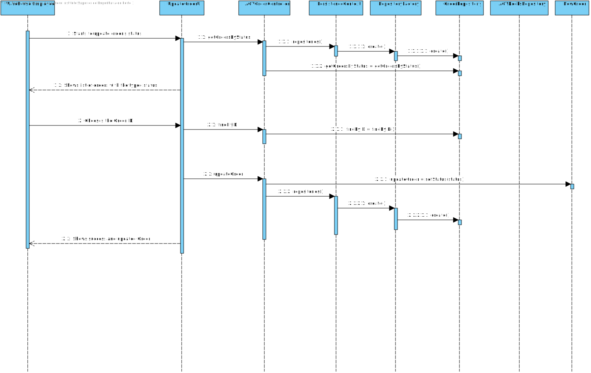

# US2004
=======================================

# 1. Requisitos

**US2004:** Como funcionário do Warehouse pretendo ...

- Ter acesso à lista de orders que já foram preparadas pelos AGVs e que seja possível alterar o Status de "ALREADY\_BEEN\_PREPARED\_BY\_THE\_AGV" para "DISPATCHED\_FOR\_CUSTOMER\_DELIVERY".

###From the client clarifications
* Q1: Regarding this feature, what would you consider to be its complete state, that is, what would be the criterion to define whether or not this feature was functional?
	* A: It seems the criteria you are looking for is somehow obvious: the status of the selected order(s) changed from "already been prepared by the AGV" to "dispatched for customer delivery".

* Q2: What do you mean by filtering the list by AGV? Do you mean the list of Product Orders ordinated by AGV name?
	* A: Orders, soon or later, will be assigned as tasks to AGVs operating on the warehouse (defined on US 2002). Some orders will be assigned, for instance, to "AGV A" while others to the "AGV XPTO" and so on... 
	* 	What is being requested is the ability to filter the presented orders by the AGV that has performed the respective task, i.e. to show the list of orders that have been prepared by a given AGVs.

# 2. Análise

###Requisitos Funcionais
- Escolher a Order pretendida com o Status "ALREADY\_BEEN\_PREPARED\_BY\_THE\_AGV";
- Esta função pode ser desempenhada por um utilizador "administrador" (admin/poweruser) ou pelo "Warehouse Employee".

###Regras de Negócio
- A Order tem de estar com o STATUS igual a "ALREADY\_BEEN\_PREPARED\_BY\_THE\_AGV";
- O Status da ORDER é alterado para "DISPATCHED\_FOR\_CUSTOMER\_DELIVERY";

# 3. Design

## 3.1. Realização da Funcionalidade

### Sequence Diagram - SD

### System Sequence Diagram - SD

## 3.3. Padrões Aplicados

*Nesta secção deve apresentar e explicar quais e como foram os padrões de design aplicados e as melhores práticas.*

## 3.4. Testes 
*Nesta secção deve sistematizar como os testes foram concebidos para permitir uma correta aferição da satisfação dos requisitos.*

# 4. Implementação

*Nesta secção a equipa deve providenciar, se necessário, algumas evidências de que a implementação está em conformidade com o design efetuado. Para além disso, deve mencionar/descrever a existência de outros ficheiros (e.g. de configuração) relevantes e destacar commits relevantes;*

*Recomenda-se que organize este conteúdo por subsecções.*

# 5. Integração/Demonstração

*Nesta secção a equipa deve descrever os esforços realizados no sentido de integrar a funcionalidade desenvolvida com as restantes funcionalidades do sistema.*

# 6. Observações

*Nesta secção sugere-se que a equipa apresente uma perspetiva critica sobre o trabalho desenvolvido apontando, por exemplo, outras alternativas e ou trabalhos futuros relacionados.*

