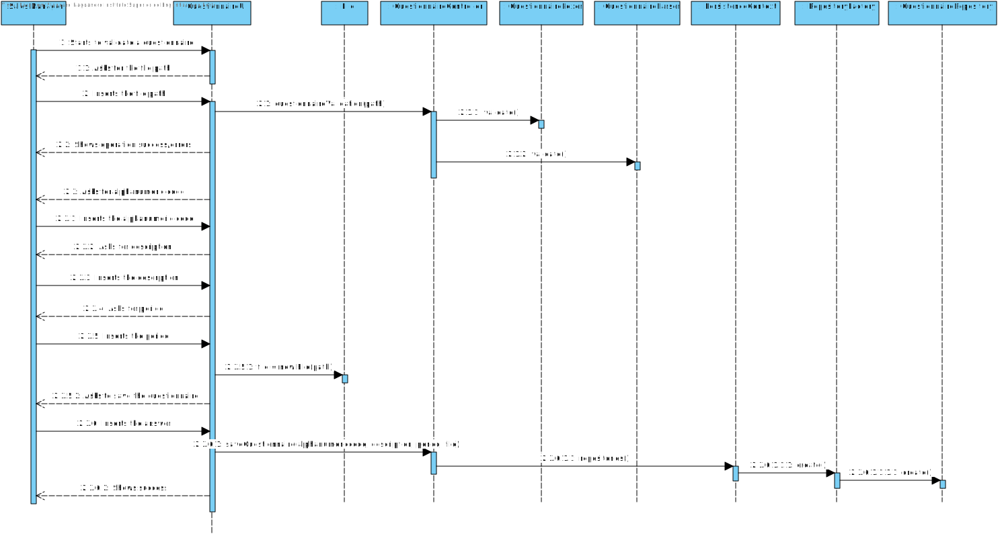
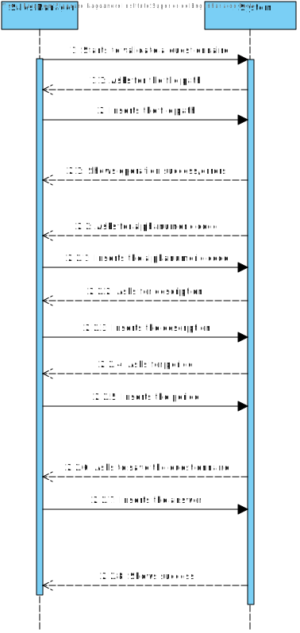

# US3001
=======================================

# 1. Requisitos

**US3001:** Como Gestor de Vendas pretendo ...

- Criar um novo questionário para ser respondido pelos Clientes no futuro.

###From the client clarifications
* Q1: The questionnaire will have to be created through the command-line interface of our application and then exported in order for it's grammar to be validated. Is my interpretation correct? Can we export it to XML, for example, and validate it's grammar afterwards?
	* A: There is no need to import/export data. Both components should be integrated.

* Q2: What are the constraints to the survey alphanumeric code and the description? 
	* A: Basic constraints:
		* Code: alphanumeric value with 15 chars max;
		* Description: non-empty short sentence (e.g.: 40 chars).

* Q3: Can you specify / define what business rules are associated to Questionnaire, Section and Question? (Eg: Questionnaire ID only has 9 characters / follows an expression).
	* A: Basic business rules related with Questionnaire, Section and Question are already available on the specifications document, namely on Table 1, 2 and 3. Teams must adopt common-sense when applying other criteria such as min/max chars length and support/explain the rationale taken.

* Q4: When a Section has a Question tagged as "Mandatory" should the section become "Mandatory" as well?
	* A: The question/answer is not straightforward. However, some consistency/coherence must exist/be assured between the "obligatoriness" of the section and of the question. You must also assure consistency with the "repeatability" information of the section.
	* Please, check carefully the example provided on section 5.1.3 of the specifications document where you can find "mandatory" sections (e.g.: section 1), "optional" sections (e.g.: section 8) and "condition dependent" sections (e.g.: section 3, 4 and 5). You can also find  "repeatable" sections (e.g.: section 6).
	* A "mandatory" or "condition dependant" section does not imply any "obligatoriness" on the questions.
	* An "optional" section implies that all questions are also "optional".
	* If a question is "mandatory", it means the user needs to answer such question no matter what is stated at the section it appears on.
	* If a question is "optional", it means that is up to the user to answer or not the question no matter what is stated at the section it appears on.
	* If a question is "condition dependent", it means the system needs to evaluate the associated condition to determine how to proceed, i.e. as "mandatory" or as "optional" question.

* Q5: Can you specify what you mean when a Question/Section is tagged with "condition dependent" and the type of conditions to be set.
	* A: If the "obligatoriness" of a question/section is "condition dependent", it means it is "mandatory" when the associated condition evaluates as "true" and it is "optional" otherwise.

* Q6: The same section can be present in more than one questionnaire? The same question can be present in more than one section?
	* A: Yes, that can happen. However, there is no intend to reutilize questions and/or sections. If that happens, the user will type the question/section again.

* Q7: When creating a questionnaire should the user give a file with the questionnaire or write each question and section trough the command line?
	* A: First of all, and to be clear, notice that creating a surveys has two distinct set of data: 
		* Alphanumeric code, a description, the period (in days) it will be performed and a set of rules that allows the system to determine the survey target audience; and
the intended questionnaire, i.e. the title, the welcome message, sections and questions.
		* I believe your question concerns the second set of data, right?
		* If so, your two options are acceptable. If the file is used, what is really important is the file content and not the file itself.
		* Moreover, notice that no matter what option you take, at the end, all the input information must be validated, which includes parsing the data regarding the "intended questionnaire".

* Q8: In the requested grammar, is it needed to distinguish the different types of questions? For example, if the user says a certain question is multiple choice, shall we make the user input the possible options specifically or do we let the user write the content of the question as he prefers?
	* A: Well, the question type is need and useful for some reason. The way you/your team take (technical) advantage of it is up to you. I really advice you to debate this issue with technical advisers (i.e. lab classes teachers).

# 2. Análise

###Requisitos Funcionais
- Inserir os dados necessários para ser possível a criação de um Customer no sistema, tais como:
	- Nome curto (shortName)
	- Nome (name)
	- Género (gender)
	- Contacto de telefone (phone)
	- NIF (VAT)
	- Endereço (postalAddress)
	- Email (email)
	- Data de Nascimento (birthDate)
- Esta função pode ser desempenhada por um utilizador "administrador" (admin/poweruser) ou pelo Sales Clerk.

###Regras de Negócio
- Nome pode ser representado por, pelo menos, o primeiro e o último. O recomendado é o nome completo.
- O VAT ID é único e varia de país para país. Pode conter letras e números.
- Contacto de telefone: segue os standards internacionais (e.g.: +351 987654321)
- Endereço:

# 3. Design

## 3.1. Realização da Funcionalidade

## 3.2. Diagrama de Classes

## 3.3. Padrões Aplicados

*Nesta secção deve apresentar e explicar quais e como foram os padrões de design aplicados e as melhores práticas.*

## 3.4. Testes 
*Nesta secção deve sistematizar como os testes foram concebidos para permitir uma correta aferição da satisfação dos requisitos.*

**Teste 1:** Verificar que não é possível criar uma instância da classe Exemplo com valores nulos.

	@Test(expected = IllegalArgumentException.class)
		public void ensureNullIsNotAllowed() {
		Exemplo instance = new Exemplo(null, null);
	}

# 4. Implementação

*Nesta secção a equipa deve providenciar, se necessário, algumas evidências de que a implementação está em conformidade com o design efetuado. Para além disso, deve mencionar/descrever a existência de outros ficheiros (e.g. de configuração) relevantes e destacar commits relevantes;*

*Recomenda-se que organize este conteúdo por subsecções.*

# 5. Integração/Demonstração

*Nesta secção a equipa deve descrever os esforços realizados no sentido de integrar a funcionalidade desenvolvida com as restantes funcionalidades do sistema.*

# 6. Observações

*Nesta secção sugere-se que a equipa apresente uma perspetiva critica sobre o trabalho desenvolvido apontando, por exemplo, outras alternativas e ou trabalhos futuros relacionados.*

