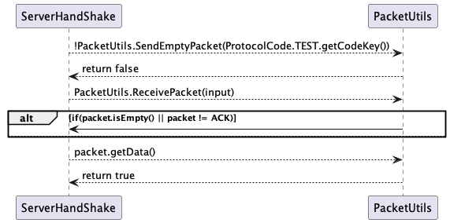

# US4001
=======================================

# 1. Requirements

**Title -** As Project Manager, I want that the "AGVManager" component is enhanced with a basic FIFO algorithm to automatically assign tasks to AGVs.

**Requirements Clarifications:**
* Q1.0: Will the FIFO algorithm be used to control the tasks/orders that are waiting for an available AGV? If I am interpreting something wrong please clarify for me. 
* Q1.1: Talking about being automatic, the System executes this functionally after some other functionality, or executes it periodically? If it is periodically, how often?
    * Q1.0: The general idea is that product orders reaching a certain state whose meaning is of "need to be prepared by an AGV" are added to a queue. Then, following the FIFO algorithm orders are removed from the queue and assigned to available AGVs capable of performing the task that such order implies. 
    * Q1.1: Teams are free to propose a solution for that problem/issue. Notice that all team decisions must be well supported in light of business need and technical constraints.

# 2. Analysis

**Requisitos Funcionais**
- Criar servidor acessível publicamente de forma direta;
- Usar um dos redirecionamento de porto que estão definidos na cloud;
- Função desempenhada pelo Project Manager;
- Configurar ligação à base de dados do lado do Servidor;
- O socket é fechado assim que existe uma mensagem de resposta.

**Regras de Negócio**
- Garantiar a utilização de portas lógicas para garantir que a aplicação que iniciou a conversação encontrará no seu destino a aplicação desejada;
- O pedido é enviado para o AGVManager, que envia um pacote de resposta independent e garante o encerramento da comunicação

# 3. Design - DEIXAR SÓ O SD

## 3.1. Realização da Funcionalidade

## 3.3. Padrões Aplicados

*Nesta secção deve apresentar e explicar quais e como foram os padrões de design aplicados e as melhores práticas.*

## 3.4. Testes 
*Nesta secção deve sistematizar como os testes foram concebidos para permitir uma correta aferição da satisfação dos requisitos.*

**Teste 1:** Verificar que não é possível criar uma instância da classe Exemplo com valores nulos.

	@Test(expected = IllegalArgumentException.class)
		public void ensureNullIsNotAllowed() {
		Exemplo instance = new Exemplo(null, null);
	}

# 4. Implementação

*Nesta secção a equipa deve providenciar, se necessário, algumas evidências de que a implementação está em conformidade com o design efetuado. Para além disso, deve mencionar/descrever a existência de outros ficheiros (e.g. de configuração) relevantes e destacar commits relevantes;*

*Recomenda-se que organize este conteúdo por subsecções.*

# 5. Integração/Demonstração

*Nesta secção a equipa deve descrever os esforços realizados no sentido de integrar a funcionalidade desenvolvida com as restantes funcionalidades do sistema.*

# 6. Observações

*Nesta secção sugere-se que a equipa apresente uma perspetiva critica sobre o trabalho desenvolvido apontando, por exemplo, outras alternativas e ou trabalhos futuros relacionados.*