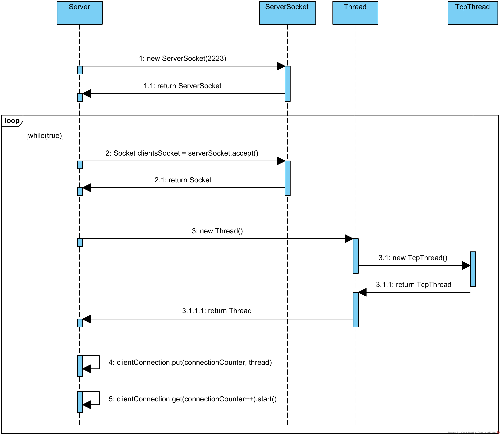
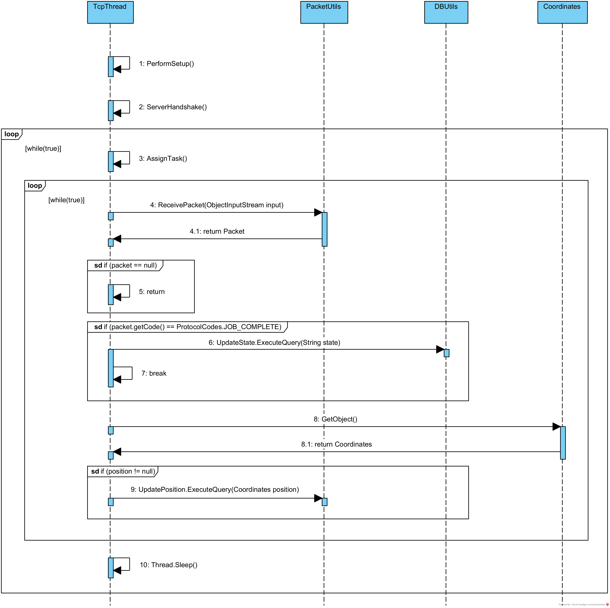
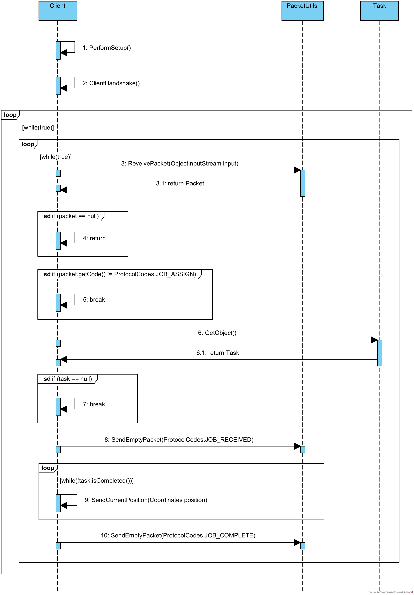

# US5001
=======================================

# 1. Requirements

**Title -** As Project Manager, I want that the team start developing the input communication module of the AGV digital twin to accept requests from the "AGVManager".

**Acceptance criteria:**
* It must be used the provided application protocol (SPOMS2022).
* It is suggested the adopting of concurrent mechanisms (e.g. threads) and state sharing between these mechanisms.
* In this sprint, for demonstration purposes, it is acceptable to mock processing some of the incoming requests to foster some output communication.

**Requirements Clarifications:**
* Q1: What type of communication do you want, i.e., what are the communications that you want to have between these two. Like AGV Manager says "Take a product" and AGV Digital Twin says "Taken"? Is it something like that? Or am i confused?
	* A: The communication must follow the SPOMS2022 protocol. It is up to you and your team to devise a set of messages fulfilling the business requirements properly.
* Q2: Regarding the USs 1901, 4001, 5001 and 5002, what would you consider its complete state, that is, what would be the criteria to define whether or not this US is functional?
	* A: For all of those USs, the communication between the two involved components must be implemented in accordance with the SPOMS2022. The requests processing can be somehow mocked. For instance, if processing a request implies saving some data to the database, the component can instead write such data to a log (mocking). Later, on next sprint, the teams implement the interaction to the database. However, it is not advisable mocking everything, namely the components (internal) state. Notice that by mocking you are letting extra effort to the next sprint. Finally, all USs must be demonstrable.
* Q3: It was mentioned that the warehouse is able to force a certain task to a certain AGV, but can this only happen when the AGV is free, or can the warehouse employee cancel a task and assign a new one?
	* A: In the scope of US 2003, the AGV is selected by the warehouse employee from the ones that are available and are able to perform the task. Tasks cannot be manually cancelled.
* Q4: Despite in the provided sprint user stories asking for the digital twin in a web dashboard along with its status and position, in user stories of the next sprint it is said that the development of the movement of the AGV is needed which causes a minor confusion. My question is in this sprint is it required to create the movement of the AGV?
	* A: On Sprint C, the web dashboard needs to be thought and ready to show the current AGVs position, which is read from some where. Further, on sprint D, when simulating the AGV movement the AGV position will change and, therefore, we will be able to see the AGVs position changing accordingly on the web dashboard. Notice that, this is an integrative project developed following an iterative and incremental process. So, at the end, the pieces need to fit well together.
* Q5: How would you like the dashboard to look? A simple list of the AGVS along with its position and status?
	* A: No! Preferably, the dashboard should be an approximation to what is depicted on Figure 8 of the specifications document.
* Q6: What type of communication do you want, i.e., what are the communications that you want to have between these two. Like AGV Manager says "Take a product" and AGV Digital Twin says "Taken"? Is it something like that? Or am i confused?
	* A: The communication must follow the SPOMS2022 protocol. It is up to you and your team to devise a set of messages fulfilling the business requirements properly.

# 2. Analysis

### Functional Requirements
- The AGV must be connected to the AGV Manager.
- The AGV must be able to receive packets over the internet from the AGV Manager.
- The AGV must be able to determine the purpose of a packet.
- The AGV must be able to convert the array of bytes inside the packet to the actual data.

### Business Rules
- In order to accept th next task, the AGV must be in the "free" state.
- After accepting a task, the AGV acquires the "busy" state.

# 3. Design

## 3.1. Functionalities

### SD - Server

### SD - TcpThread

### SD - Client

## 3.3. Applied patterns

* The SPOMS Protocol was utilized to design the communications module

## 3.4. Testes 
*Nesta secção deve sistematizar como os testes foram concebidos para permitir uma correta aferição da satisfação dos requisitos.*

**Teste 1:** Verificar que não é possível criar uma instância da classe Exemplo com valores nulos.

	@Test(expected = IllegalArgumentException.class)
		public void ensureNullIsNotAllowed() {
		Exemplo instance = new Exemplo(null, null);
	}

# 4. Implementation

* Commits:
  * https://bitbucket.org/1200626/lei21_22_s4_2dk_03/commits/14110be0e5993e0a67de6a54c044744ff46f5130
  * https://bitbucket.org/1200626/lei21_22_s4_2dk_03/commits/6ea74747db2491f82bd664eb82f04eb81c15900d
  * https://bitbucket.org/1200626/lei21_22_s4_2dk_03/commits/3017f2a9ad449f36d9f8b02464ae1a024a0e44dc
  * https://bitbucket.org/1200626/lei21_22_s4_2dk_03/commits/6f030fcbc58c6a0da9d66f46db7550b46c4253fc
  * https://bitbucket.org/1200626/lei21_22_s4_2dk_03/commits/8399d9b6dd160c4271a520a9254a3e1e76894bb5
  * https://bitbucket.org/1200626/lei21_22_s4_2dk_03/commits/231a35abba18f52344993d4b00e798de63557193
  * https://bitbucket.org/1200626/lei21_22_s4_2dk_03/commits/0448b1a3bd3aff17ca89883c8522be451f9b8f4c
  * https://bitbucket.org/1200626/lei21_22_s4_2dk_03/commits/86fb9b102a2e85a66b751f44e754a65512525746
  * https://bitbucket.org/1200626/lei21_22_s4_2dk_03/commits/c75096bd0a0bffe0fcc5e8fd0945405c47f61a69
  * https://bitbucket.org/1200626/lei21_22_s4_2dk_03/commits/9cbfb5fe9feed682e536538a77ec22d3da88e4eb

# 5. Integration/Demonstration

* This functionality (Client-side) was created by collaborating with the member os the team in charge of the AGV Manager (Server-side)

# 6. Observations

* The Task class that was created to help inform the communications between AGV Manager and the AGV Digital Twin is going to be replaced in the next sprint with an Order