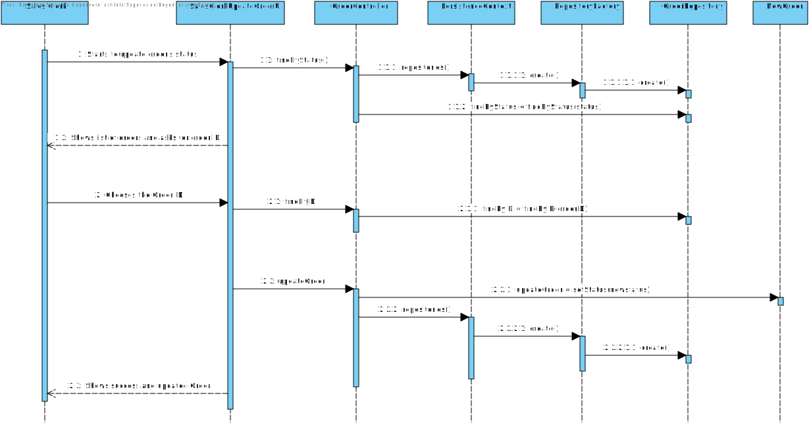
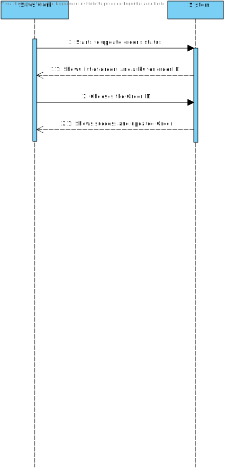

# US1006
=======================================

# 1. Requisitos

* Como Sales Clerk pretendo ter acesso à lista de orders que já foram despachadas para entrega ao cliente e que seja possível alterar o Status de "DISPATCHED\_FOR\_CUSTOMER\_DELIVERY" para "BEING\_DELIVERY".
* Para isso, deve iniciar sessão com o login do Sales Clerk e selecionar o menu "Sales Clerk" onde irá aparecer uma opção "Update Order Status".
* Uma vez neste menu, será automaticamente feita a pesquisa à base de dados pelas orders com o status "DISPATCHED\_FOR\_CUSTOMER\_DELIVERY" para que seja possível escolher o ID correspondente à order que queremos atualizar.
* Uma vez inserido o ID da order, esta irá atualizar de forma autónoma o status para "BEING\_DELIVERY" mostrando depois a order atualizada.

# 2. Análise

###Requisitos Funcionais
- Escolher o ID da Order a atualizar;
- Esta função pode ser desempenhada por um utilizador "administrador" (admin/poweruser) ou pelo "Sales Clerk".

###Regras de Negócio
- As orders que aparecem são apenas as que têm o status "DISPATCHED\_FOR\_CUSTOMER\_DELIVERY";
- Depois de inserido o ID da order, o status da mesma é alterado para "BEING\_DELIVERY";

###From the client clarifications

* Q1: For this US, the information to present to the Sales Clerk should be different than the information shown to the Warehouse Employee in a similar US or should it have the same information fields?
	* A: Which is the similar US you are talking about? I would say that some fields might be the same (e.g. order id, date, customer) and differ on others. For instance, within this US the dispatching' date seems to be an important information.

# 3. Design

## 3.1. Realização da Funcionalidade

### Sequence Diagram - SD

### System Sequence Diagram - SD

## 3.3. Padrões Aplicados

*Nesta secção deve apresentar e explicar quais e como foram os padrões de design aplicados e as melhores práticas.*

## 3.4. Testes 
*Nesta secção deve sistematizar como os testes foram concebidos para permitir uma correta aferição da satisfação dos requisitos.*

# 4. Implementação

*Nesta secção a equipa deve providenciar, se necessário, algumas evidências de que a implementação está em conformidade com o design efetuado. Para além disso, deve mencionar/descrever a existência de outros ficheiros (e.g. de configuração) relevantes e destacar commits relevantes;*

*Recomenda-se que organize este conteúdo por subsecções.*

# 5. Integração/Demonstração

*Nesta secção a equipa deve descrever os esforços realizados no sentido de integrar a funcionalidade desenvolvida com as restantes funcionalidades do sistema.*

# 6. Observações

*Nesta secção sugere-se que a equipa apresente uma perspetiva critica sobre o trabalho desenvolvido apontando, por exemplo, outras alternativas e ou trabalhos futuros relacionados.*

