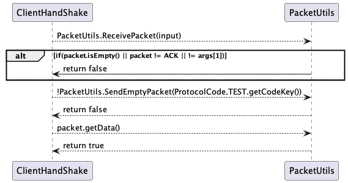

# US1902
=======================================

# 1. Requirements

**Title -** As Project Manager, I want the communications made through the SPOMS2022 protocol to be secured/protected.

**Acceptance criteria:**
* It should be adopted SSL/TLS with mutual authentication based on public key certificates.
  It complements the US1901.

**Requirements Clarifications:**
* Q1: Should DLength1 and Dlength2 be generated randomly? Or should we generate one first and then calculate the other?
	* A:  I believe that you mean "D_Length_1" and "D_Length_1" of the SPOMS protocol, right? If this is right, the answer is no. You have to compute such values.
* Q2: Regarding the USs 1901,4001, 5001, and 5002, what would you consider its complete state, that is, what would be the criterion to define whether or not this US is functional?
	* A: For all of those USs, the communication between the two involved components must be implemented in accordance with the SPOMS2022. The requests processing can be somehow mocked. For instance, if processing a request implies saving some data to the database, the component can instead write such data to a log (mocking). Later, on next sprint, the teams implement the interaction to the database. However, it is not advisable mocking everything, namely the components (internal) state. Notice that by mocking you are letting extra effort to the next sprint. Finally, all USs must be demonstrable.
    
# 2. Analysis

**Requisitos Funcionais**
- Criar servidor acessível publicamente de forma direta;
- Usar um dos redirecionamento de porto que está definido na cloud;
- Configurar ligação à base de dados do lado do Servidor;
- O socket é fechado assim que existe uma mensagem de resposta.

**Regras de Negócio**
- Garantiar a utilização de portas para garantir que a aplicação Cliente assim que inicie a conversação encontrará no Server a aplicação desejada;
- O pedido é enviado para o AGVManager, que envia um pacote de resposta independente e garante o encerramento da comunicação.

# 3. Design - DEIXAR SÓ O SD

## 3.1. Realização da Funcionalidade

### SD Server -> Handshake

### SD Client -> Handshake

## 3.3. Padrões Aplicados

* The SPOMS2022P was utilized to design the communications module

## 3.4. Testes 
*Nesta secção deve sistematizar como os testes foram concebidos para permitir uma correta aferição da satisfação dos requisitos.*

**Teste 1:** Verificar que não é possível criar uma instância da classe Exemplo com valores nulos.

	@Test(expected = IllegalArgumentException.class)
		public void ensureNullIsNotAllowed() {
		Exemplo instance = new Exemplo(null, null);
	}

# 4. Implementação

*Nesta secção a equipa deve providenciar, se necessário, algumas evidências de que a implementação está em conformidade com o design efetuado. Para além disso, deve mencionar/descrever a existência de outros ficheiros (e.g. de configuração) relevantes e destacar commits relevantes;*

*Recomenda-se que organize este conteúdo por subsecções.*

# 5. Integração/Demonstração

*Nesta secção a equipa deve descrever os esforços realizados no sentido de integrar a funcionalidade desenvolvida com as restantes funcionalidades do sistema.*

# 6. Observações

*Nesta secção sugere-se que a equipa apresente uma perspetiva critica sobre o trabalho desenvolvido apontando, por exemplo, outras alternativas e ou trabalhos futuros relacionados.*