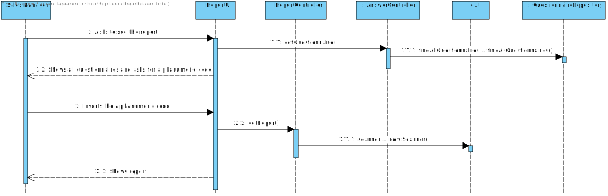

# US3002
=======================================

# 1. Requisitos

* Como Sales Manager pretendo obter um relatório estatístico referente a um questionário previamente respondido.
* Para isso, deve iniciar sessão com o login do Sales Manager e selecionar o menu "Sales Manager" onde irão aparecer os questionários disponíveis para obter o relatório.

# 2. Análise

###Requisitos Funcionais
- Através do relatório é possível obter:
	- Número de pessoas que responderam;
	- % de questões respondidas;
	- Número de questões respondidas;
	- Distribuição percentual de respostas para as diferentes opções nas Single-Choice;
	- Distribuição percentual de respostas para as diferentes opções nas Multiple-Choice;
	- Distribuição percentual de conjuntos de respostas para as diferentes opções nas Multiple-Choice;

###From the client clarifications

* Q1: For this US, what are the types of statistical report that Sales Clerk want to see?
	* A: Any report must have the basic:
		* Universe Size (implies knowing the amount of users the survey was distributed to);
		* Number of Responses Obtained 
		* % of responses obtained;

	* Further, something depending on the question type:
		* For “Single-Choice” questions:
			* Distribution (in %) of responses for each alternative (e.g.: A = 30%, B = 27%, C = 40%, Others = 3%)
		* For “Multiple-Choice” questions:
			* Distribution (in %) of responses for each alternative (e.g.: A = 30%, B = 27%, C = 40%, Others = 3%)
			* Distribution (in %) of combined responses (e.g.: A+B = 15%, A+C = 100%, B+C=100%, A+B+C=10%)
		* For “Sorting-Options” questions:
			* Distribution of the various hypotheses for each position (e.g.: 1st Place = A(40%) B (60%) C(0%); 2nd Place = A(50%) B(40%) C(10%); 3rd Place =A(10%) C(90%))

		* For “Scaling-Options” questions:
			* Distribution of each option by scale levels.

* Q2: For this US, does the statistical report need to be shown to the SalesClerk or needs to be saved in some file too (p.e. text file)?
	* A: The important is to show the statistical report. Saving the report is not seen as relevant since, at any time, the user might request to see the report again. Notice that the information on which the report is computed is already persisted on the system.

# 3. Design

## 3.1. Realização da Funcionalidade

### Sequence Diagram - SD

### System Sequence Diagram - SD

## 3.3. Padrões Aplicados

*Nesta secção deve apresentar e explicar quais e como foram os padrões de design aplicados e as melhores práticas.*

## 3.4. Testes 
*Nesta secção deve sistematizar como os testes foram concebidos para permitir uma correta aferição da satisfação dos requisitos.*

# 4. Implementação

*Nesta secção a equipa deve providenciar, se necessário, algumas evidências de que a implementação está em conformidade com o design efetuado. Para além disso, deve mencionar/descrever a existência de outros ficheiros (e.g. de configuração) relevantes e destacar commits relevantes;*

*Recomenda-se que organize este conteúdo por subsecções.*

# 5. Integração/Demonstração

*Nesta secção a equipa deve descrever os esforços realizados no sentido de integrar a funcionalidade desenvolvida com as restantes funcionalidades do sistema.*

# 6. Observações

*Nesta secção sugere-se que a equipa apresente uma perspetiva critica sobre o trabalho desenvolvido apontando, por exemplo, outras alternativas e ou trabalhos futuros relacionados.*

