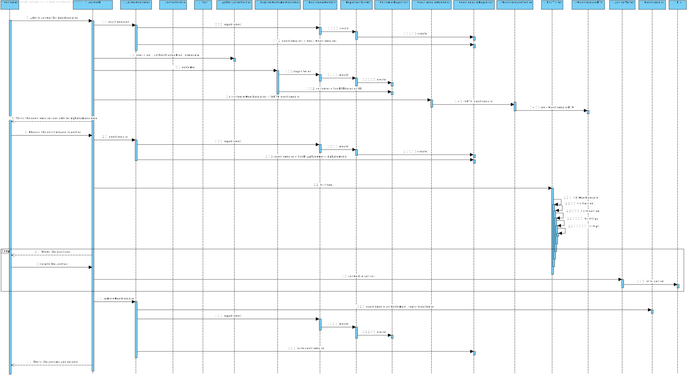

# US3501
=======================================

# 1. Requisitos

* Como Customer pretendo obter uma lista de questionários que o sistema me está a pedir para responder e que seja possível responder a qualquer um desses questionários.
* Para isso, deve iniciar sessão com o login do Customer e selecionar o menu "Customer" onde irão aparecer os questionários disponíveis para responder.
* De seguida, deve indicar o "alphanumeric code" referente ao questionário que pretende responder e as respostas serão automaticamente guardadas num ficheiro de texto (.txt).

# 2. Análise

###Requisitos Funcionais
- Escolher o questionário a responder;
- Esta função pode ser desempenhada por um utilizador "administrador" (admin/poweruser) ou pelo Customer.

###Regras de Negócio
- 

###From the client clarifications

* Q1: The US says: "As Customer, I want to get the list of questionnaires that the system is asking me to answer and be able to answer any of those questionnaires." Previously the customer had said that there were keywords in the creation of the questionnaire.... How can we relate those keywords to a client? Or is there a more direct relationship between the customer and the questionnaire, for example:
	- A questionnaire is created about sneakers.
	- The client orders some sneakers, so the questionnaire about sneakers will appear.

* Also, when the questionnaires appear, can there be an option to answer later? In case the customer doesn't want to answer at that specific time?
	* A: The "relationship" between the questionnaire and customers is somehow established when creating the questionnaire (US 3001), namely when the user is specifying the criteria that target customers must met (e.g.: have ordered a given product; belong to a given age group). Regarding "an option to answer later", do not turn the easy things more complex than it is really needed.

* Q2: In regard to the survey rules, can a survey have multiple of them?
	* A: It would be nice to specify more than one condition in the same rule and have more than one rule.

* Q3: If multiple rules were chosen for a given survey, would these be used in conjunction or disjunction?
	* A: Example:
		* Rule 1 (two conditions): "Having ordered a certain product (C1) and be of a certain gender (C2)". 
		* Rule 2 (one condition): "Living in Porto district".
		* The target customers would be the ones meeting Rule 1 or Rule 2.
		* So, you have conjunction inside a rule (C1 and C2) and disjunction between rules (R1 or R2).

* Q4: Which of the following scenarios do you want for the action of determining the target audience of each survey/questionnaire:
	* Scenario 1: After a survey is created, the target audience for that survey is identified at the moment of the survey creation and cannot be extended in the future. Example: if a survey is created at the 1st of June and one of the rules for that survey is that a client must be of male gender than the target audience of that survey will be all the male customers registered up until the 1st of June. If a new male customer arises on the 2nd of June he will not be considered as a target audience of that survey.
	* Scenario 2: The target audience of each survey is constantly extended up until the end date of the survey/questionnaire. Example: if a survey is created at the 1st of June and it’s end date is at the 20th of June and one of the rules for that survey is that a client must be of male gender, than all existent male customers up until the 1st of June and all the clients with male gender that arise between the 1st of June and the 20th of June will also be eligible for that survey/questionnaire.
	* A: In the scope of Sprint D, the first scenario is more than enough.

* Q5: The defined architecture for the product indicates that requests from the Customer App to the Database must go through the Orders Server. As such, I was wondering if the same applies when the Customer App needs the Surveys to show to the customers, that is, if the Customer App can or not directly communicate with the Database to request the surveys or if the surveys need to come from the Orders Server. I assume that it is the second option, but just to make sure.
	* A: The specifications' document states (page 10):
		* A direct connection to the database (graphically depicted on red) must be avoid. Instead, data requests should be made through the “Orders API” exposed by the “Orders Server” component.
		* A server application, called “Orders Server”, responsible to fulfill the all the data requests necessary to the “Customer Application” works properly.
		* As so, I believe there is no reason to your doubt.

* Q6: When showing the questionnaire questions and asking for the awnsers to the costumer, should we use a graphical interface or the command line?
	* A: The customer is using a "console application" as stated in the specifications' document.
	* When a non-console UI is required, that is being requested explicitly (e.g. US 2005), which is NOT the case of US 3501.
	* As so, a console UI is enough.

* Q7: Can a customer answer the same survey multiple times? Or should he only be able to answer the survey once?
	* A: No!

# 3. Design

## 3.1. Realização da Funcionalidade

### Sequence Diagram - SD

### System Sequence Diagram - SD

## 3.3. Padrões Aplicados

*Nesta secção deve apresentar e explicar quais e como foram os padrões de design aplicados e as melhores práticas.*

## 3.4. Testes 

**QuestionnaireTest**

	public class QuestionnaireTest {
	    String path = "/Users/tiagoandre/Downloads/lei21_22_s4_2dk_03/base.core/src/main/java/eapli/base/antlr4/Questionnaire1.txt";
	    File questionnaire_file = new File(path);
	    byte[] file = new byte[(int) questionnaire_file.length()];
	    Questionnaire questionnaire = new Questionnaire(AlphanumericCodeQuestionnaire.valueOf("COSM22-01"), Description.valueOf("Football Questionnaire"), PeriodQuestionnaire.valueOf(30), file);
	
	    @Test
	    public void testGetAlphanumericCode() {
	        AlphanumericCodeQuestionnaire alphanumericCodeQuestionnaire = AlphanumericCodeQuestionnaire.valueOf("COSM22-01");
	
	        Assertions.assertEquals(alphanumericCodeQuestionnaire.toString(), questionnaire.getAlphanumericCode().toString(), "testGetAlphanumericCode()");
	    }
	
	    @Test
	    public void testGetDescription() {
	        Description description = Description.valueOf("Football Questionnaire");
	
	        Assertions.assertEquals(description.toString(), questionnaire.getQuestionnaireDescription().toString(), "testGetDescription()");
	    }
	
	    @Test
	    public void testGetPeriod() {
	        PeriodQuestionnaire periodQuestionnaire = PeriodQuestionnaire.valueOf(30);
	
	        Assertions.assertEquals(periodQuestionnaire.toString(), questionnaire.getPeriod().toString(), "testGetPeriod()");
	    }
	
	    @Test
	    public void testSetAlphanumericCode() {
	        AlphanumericCodeQuestionnaire alphanumericCodeQuestionnaire = AlphanumericCodeQuestionnaire.valueOf("COSMETIC22-01");
	        questionnaire.setAlphanumericCode(alphanumericCodeQuestionnaire);
	
	        Assertions.assertEquals(alphanumericCodeQuestionnaire.toString(), questionnaire.getAlphanumericCode().toString(), "testSetAlphanumericCode()");
	    }
	
	    @Test
	    public void testSetDescription() {
	        Description description = Description.valueOf("Cosmetic Questionnaire");
	        questionnaire.setQuestionnaireDescription(description);
	
	        Assertions.assertEquals(description.toString(), questionnaire.getQuestionnaireDescription().toString(), "testSetDescription()");
	    }
	
	    @Test
	    public void testSetPeriod() {
	        PeriodQuestionnaire periodQuestionnaire = PeriodQuestionnaire.valueOf(15);
	        questionnaire.setPeriod(periodQuestionnaire);
	
	        Assertions.assertEquals(periodQuestionnaire.toString(), questionnaire.getPeriod().toString(), "testSetPeriod()");
    	}
	}
	
**AnswerTest**

		public class AnswerTest {
	    Customer customer = new Customer(Name.valueOf("Tiago", "Pinto"), NameCustomer.valueOf("Tiago André Pinto"), GenderCustomer.valueOf("male"), PhoneCustomer.valueOf(351, 913913913), VATCustomer.valueOf("PT913913913"), "Maia", EmailAddress.valueOf("tpinto@emai.l.com"), BirthDateCustomer.valueOf(1997, 9, 13));
	    Map<String, String> map = new HashMap<>();
	    Answer answer = new Answer(AnswerID.valueOf(1), customer, map);
	
	    @Test
	    public void testGetAnswerID() {
	        AnswerID answerID = AnswerID.valueOf(1);
	
	        Assertions.assertEquals(answerID.toString(), answer.getAnswerID().toString());
	    }
	
	    @Test
	    public void testSetAnswerID() {
	        AnswerID answerID = AnswerID.valueOf(2);
	
	        answer.setAnswerID(AnswerID.valueOf(2));
	        Assertions.assertEquals(answerID.toString(), answer.getAnswerID().toString());
	    }
	
	    @Test
	    public void testGetCustomer() {
	        Customer customer = new Customer(Name.valueOf("Tiago", "Pinto"), NameCustomer.valueOf("Tiago André Pinto"), GenderCustomer.valueOf("male"), PhoneCustomer.valueOf(351, 913913913), VATCustomer.valueOf("PT913913913"), "Maia", EmailAddress.valueOf("tpinto@emai.l.com"), BirthDateCustomer.valueOf(1997, 9, 13));
	
	        Assertions.assertEquals(customer.toString(), answer.getCustomer().toString());
	    }
	
	    @Test
	    public void testSetCustomer() {
	        Customer customer1 = new Customer(Name.valueOf("Tiago", "Andre"), NameCustomer.valueOf("Tiago André Pinto"), GenderCustomer.valueOf("male"), PhoneCustomer.valueOf(351, 913913913), VATCustomer.valueOf("PT913913913"), "Maia", EmailAddress.valueOf("tpinto@emai.l.com"), BirthDateCustomer.valueOf(1997, 9, 13));
	
	        answer.setCustomer(customer1);
	        Assertions.assertEquals(customer1.toString(), answer.getCustomer().toString());
	    }
	
	    @Test
	    public void testGetAll_Answers() {
	        map.put("Q1:", "25");
	        map.put("Q2:", "25");
	        map.put("Q3:", "male");
	        map.put("Q4:", "Not Answered.");
	        map.put("Q5:", "friends");
	
	        Assertions.assertEquals(map.toString(), answer.getAll_answers().toString());
	    }
	
	    @Test
	    public void testSetAll_Answers() {
	        map.put("Q1:", "25");
	        map.put("Q2:", "25");
	        map.put("Q3:", "male");
	        map.put("Q4:", "no");
	        map.put("Q5:", "friends");
	
	        answer.setAll_answers(map);
	        Assertions.assertEquals(map.toString(), answer.getAll_answers().toString());
	    }
	}

**RulesQuestionnaireTest**

			public class RuleQuestionnaireTest {
	    RulesQuestionnaire rulesQuestionnaire = new RulesQuestionnaire(18, "male");
	    @Test
	    public void testGetMinimum_Age() {
	        int age = 18;
	
	        Assertions.assertEquals(age, rulesQuestionnaire.getMinimum_age());
	    }
	
	    @Test
	    public void testSetMinimum_Age() {
	        int age = 20;
	        rulesQuestionnaire.setMinimum_age(age);
	
	        Assertions.assertEquals(age, rulesQuestionnaire.getMinimum_age());
	    }
	
	    @Test
	    public void testGetGender() {
	        String gender = "male";
	
	        Assertions.assertEquals(gender, rulesQuestionnaire.getGender());
	    }
	
	    @Test
	    public void testSetGender() {
	        String gender = "other";
	        rulesQuestionnaire.setGender(gender);
	
	        Assertions.assertEquals(gender, rulesQuestionnaire.getGender());
	    }
	}

# 4. Implementação

*Nesta secção a equipa deve providenciar, se necessário, algumas evidências de que a implementação está em conformidade com o design efetuado. Para além disso, deve mencionar/descrever a existência de outros ficheiros (e.g. de configuração) relevantes e destacar commits relevantes;*

*Recomenda-se que organize este conteúdo por subsecções.*

# 5. Integração/Demonstração

*Nesta secção a equipa deve descrever os esforços realizados no sentido de integrar a funcionalidade desenvolvida com as restantes funcionalidades do sistema.*

# 6. Observações

*Nesta secção sugere-se que a equipa apresente uma perspetiva critica sobre o trabalho desenvolvido apontando, por exemplo, outras alternativas e ou trabalhos futuros relacionados.*

